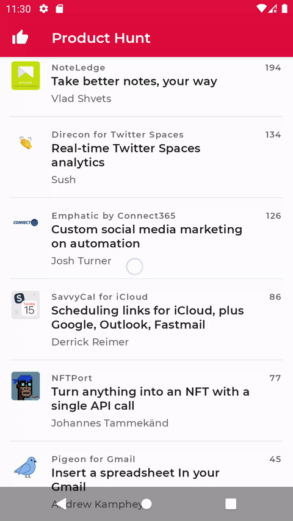

# Product Hunt



Product Hunt Android app using Jetpack Compose.
The app supports both day mode and night mode.

⚡️ A runnable debug version of the app is [available in `apk/app-debug.apk`](apk/app-debug.apk), just copy it in your Android device to see it in action!

👀 Before running the project it's important to set the API Key and API Secret in the [`Apollo.kt` file](https://github.com/simoarpe/product-hunt/blob/main/app/src/main/java/com/sarpex/producthunt/Apollo.kt#L75-L76). Refer to the [OAuth section](#-oauth) for all the steps.

💻 Requirements
------------
To try out the Product Hunt sample app, you need to use [Android Studio Arctic Fox](https://developer.android.com/studio) or greater.

🧬 Architecture
------------
The project uses an MVVM architecture built in a Redux-style, where each UI 'screen' has its own [ViewModel](https://developer.android.com/topic/libraries/architecture/viewmodel).
Each [ViewModel](https://developer.android.com/topic/libraries/architecture/viewmodel) is responsible for subscribing to any data streams required for the view, as well as exposing functions which allow the UI to send events.

The app uses the latest tech stack, like [Kotlin coroutines](https://developer.android.com/kotlin/coroutines), [flows](https://developer.android.com/kotlin/flow), and an optimized blazing-fast pagination logic based upon the [Jetpack Paging library](https://developer.android.com/jetpack/androidx/releases/paging) for compose.

Images are loaded in a separate thread pool, optimized for I/O using [Coil](https://github.com/coil-kt/coil).

📦 Package structure
------------
- `model` Contains the data models.
- `ui` Contains UI controllers and view models.
	- `theme` 
		- `Color.kt`
		- `Shape.kt`
		- `Theme.kt`
		- `Type.kt`
- `util` Util package containing all the util functions.
- `data` Additional data structure package used by UI controllers and view models.
- `network` Classes network related for authentication operations and requests.

🔗 Useful Links
------------
- `https://api.producthunt.com/v2/docs` - Starting point with all the info
- `https://api.producthunt.com/v2/docs/oauth_client_only_authentication/oauth_token_ask_for_client_level_token` - OAuth Client Only Authentication
- `https://ph-graph-api-explorer.herokuapp.com/` - API Explorer
- `http://api-v2-docs.producthunt.com.s3-website-us-east-1.amazonaws.com/operation/query/` - GraphQL Query
- `https://www.howtographql.com/` - Learn GraphQL

🔑 OAuth
------------

Navigate to `https://www.producthunt.com/v2/oauth/applications` and select "ADD AN APPLICATION".

Set the redirect URI to `https://producthunt.com`.  
Save API Key and API Secret and set them in the [`Apollo.kt` file](https://github.com/simoarpe/product-hunt/blob/main/app/src/main/java/com/sarpex/producthunt/Apollo.kt#L75-L76).

Extra info from the [starting point URL](https://api.producthunt.com/v2/docs):

Get a token without user context. (E.g. before a user logs in).

Follow the steps explained in OAuth Client Only Authentication `oauth#token`
Please remember that this tokens limit you to public endpoints that don't require user context.

If you want to access our API without any user context this is the right authentication for you.
Typical usecases might be your mobile app that wants to show the current posts to not-yet-logged-in users.

🕸 GraphQL
------------

Generated using:

```bash
get-graphql-schema -h 'Authorization=Bearer {token}' https://api.producthunt.com/v2/api/graphql -j > schema.json
```

Check `schema.json`.

### Apollo GraphQL for Android

From `https://www.apollographql.com/docs/android/`

Version 3 for Android is still in alpha, so we'll stick to the latest major for the version 2 (`2.5.9`).

**Note:** Farewell JCenter, welcome back Maven Central.

### Cache Support

HTTP Cache: `https://www.apollographql.com/docs/android/essentials/http-cache/`.

Normalized Cache `https://www.apollographql.com/docs/android/essentials/normalized-cache/`

Without knowing all the use cases it's best to stick with the simplest solution, so I'd go for a cache first approach with `CACHE_FIRST`.


🧑‍🏫 Project Overview
------------

The app has the following screens:

• **Home Screen**: it contains the list of daily post items; the list should load more as the user scrolls.  
• **Post item**: it shows post name, thumbnail, tagline, vote count, and hunter.  
• **Post details screen**: opens after the user tap on the post item and shows post info: name, thumbnail, tagline, description, vote count, hunter, list of makers (users), media only showing images, not video.  
• **User profile screen**: it opens when user tap on user avatar, hunter or maker and it shows user info, user name, username, avatar and has an infinite scroll list of post items the user has voted.  

